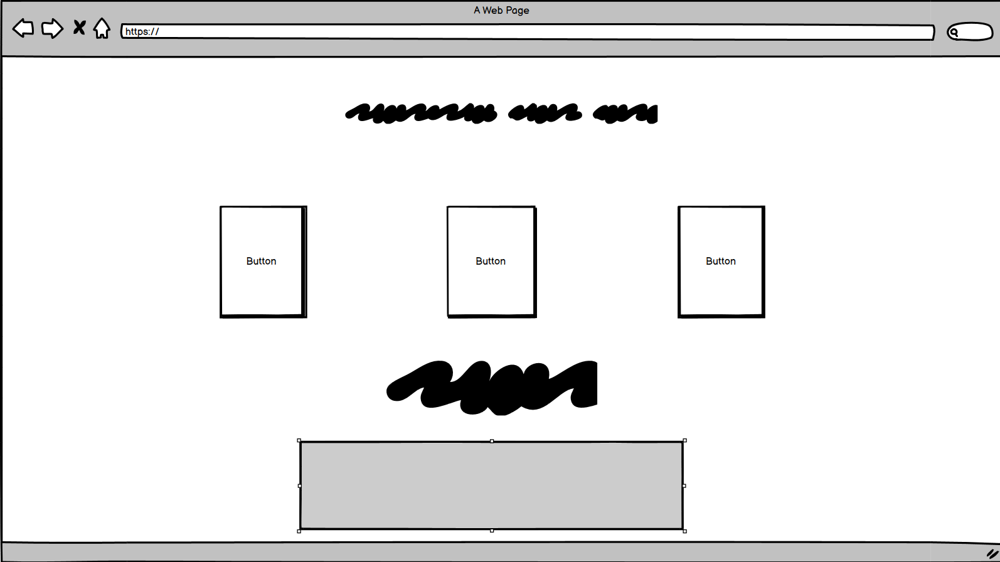
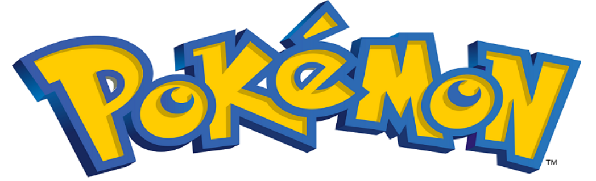
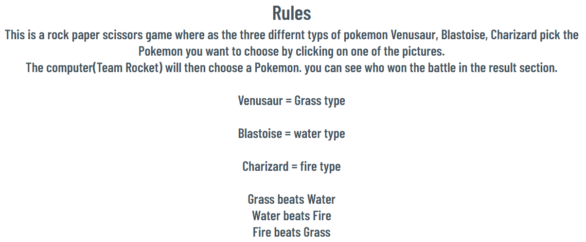
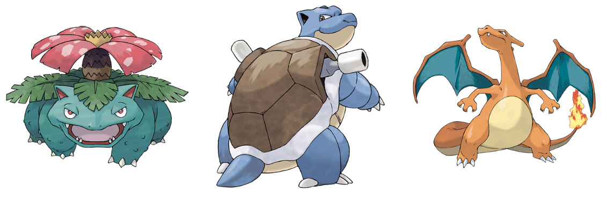
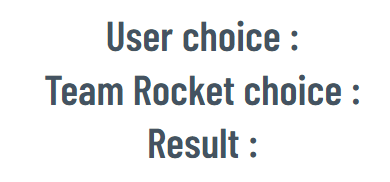
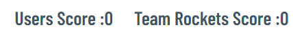
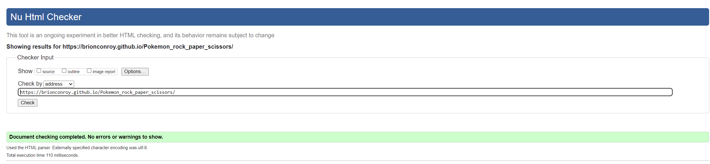
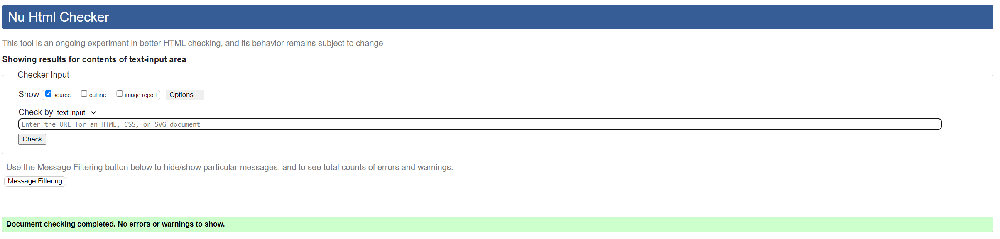
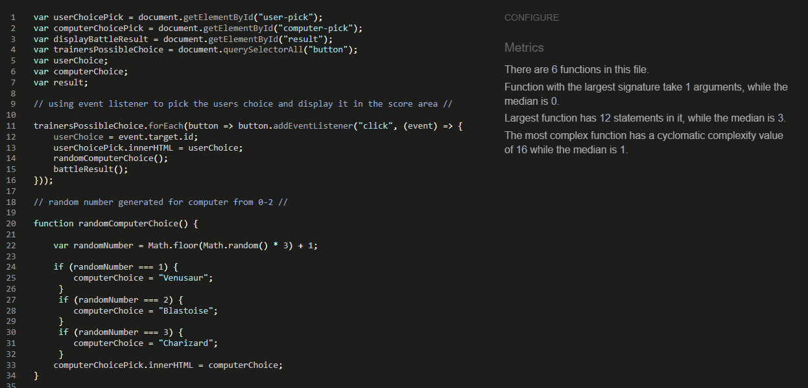
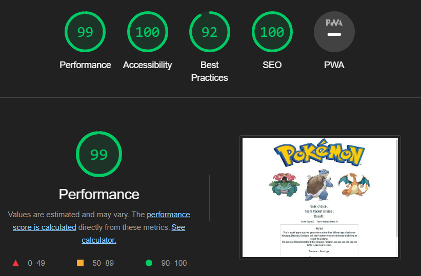

# Pokemon Battle

Pokemon battle game is a twist on a Rock, Paper, Scissors. The Pokemon battle game has come from the TV series Pokemon where different types of Pokemon have leverage over each other. Fire beats grass, grass beats water, and so on. I thought this might be a good idea for a themed rock, paper, scissors game. The pokemon Battle game lets you play agianst the computer and pick from three different types of pokemons. 

## User Experience (UX)

As a new visitor to the site, I want to be able to quickly and simply understand what the site does and the rules of the game. As a returning user to the site i want to quickly navigate to the game without interruptions.

## Design (UXD)

The User Experience Design was constructed using the five planes.

+ Stretagy: Is this content relevant to the user and is it culturally appropriate?
+ Scope: Are we accomplishing our goals of broadcasting the product?
+ Structure: How many pages should we have in our website and why?
+ Skeleton: Does the structure of the wireframe meet the costumer's/user's needs? Is the web page responsive?
+ Surface: Does the site look good visually? Does it have enough images and colours?

# Features 

## Logo

The image logo gives the user a clear indication of the theme of the site.

## Rules

The rules let the user know how the game will play. 
The rules also let the user know how to win the game.
Which Pokemon beats which Pokemon.

## User options

This section has the three possible options the user can make.
The three buttons will respond to you when you hover over them and click them.

## computer options

The computer picks a random number between 0-2 each number corresponds to one of the Pokemon.
The Pokemon is displayed and the battle can begin.

## Result section

This area shows the result of the battle, whether it was a win, a draw, or a lose.

## Score board

This section tells you how many times you've won or lost against the computer.

## Features id like top add in the fututer

+ I would like to add an Easter egg where a Pikachu image comes onto the screen and shocks everyone and the game resets to 0.
+ I would also like to add a log-in for the user to make it more interactive. A User name would come up in place of user selection. 

## Bugs

One bug I came across was my user choice was not appearing when selected. This was because I had used and ID selector and not a class selector.

## Testing

I tested this website on different browsers: Edge, Chrome, Firefox, and Safari.
The web page is responsive and looks great on all standard screen sizes using Devtools on Google Chrome.
I have made sure that all my headings and text are easy to read and understand.

## Validation Testing

### HTML

No errors were found when passing the website through the official W3C Validator.

### CSS

No errors were found when passing the website through the official Jigsaw Validator.

### JavaScript

No errors were found when passing my Javascript code through the JSHint validator.

### Lighthouse

I used Lighthouse to make sure that my page accessible and easily readable.

## Deployment

The site was deployed using Github pages:

Go to github repositories, click on the settings tab.
Click on pages in the bar on the left hand side.
Click on Branches makes sure it is set to main, and click save.
Refresh the page and you will see a URL link to your page.

https://brionconroy.github.io/Pokemon_rock_paper_scissors/

## Credits

Thanks to the tutors at Coding Institute and to my mentor Anthony for guiding me through my first project. I would also like to thank Katie Duggan for proofreading the content.

## Content

+ My correct answers were taken from love maths project.
+ My font was taken from [Google Fonts](https://fonts.google.com/)
+ My images where taken from [bulbagarden](https://pokemondb.net/pokedex/blastoise)
+ Helping me come to turms with JavaScript [Youtube](https://www.youtube.com/watch?v=RwFeg0cEZvQ)
+ Help in hiding text in css [Quora](https://www.quora.com/How-do-you-hide-text-in-CSS)